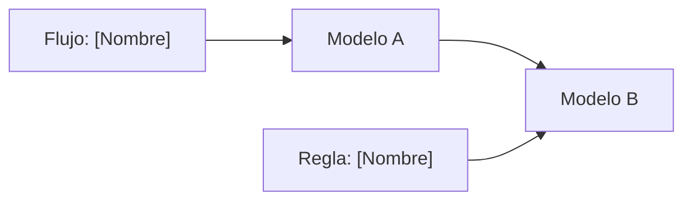

# Mapa de [Nombre del contexto]

Este archivo representa modelos, reglas, eventos o flujos relevantes dentro del contexto.

## Formato

````md
---
type: model-map | interaction-map
scope: [Nombre del contexto]
---

# Mapa de [Nombre del contexto]

## Proposito

[Que ayuda a entender este mapa.]

## Diagrama



## Lectura del mapa

* `Modelo A` se relaciona con `Modelo B` porque [motivo funcional].
* El flujo [Nombre] modifica o consulta `Modelo A`.
* La regla [Nombre] limita `Modelo B`.
````

## Diagrama


## Lectura del mapa

* `Modelo A` se relaciona con `Modelo B` porque [motivo funcional].
* El flujo [Nombre] modifica o consulta `Modelo A`.
* La regla [Nombre] limita `Modelo B`.
